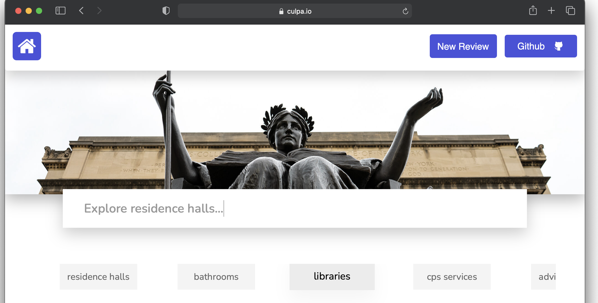

# Culpa.io

Culpa.io is an open source resource for students at Columbia to anonymously review courses, professors, and more. It's been used over 100,000 times since its inception in September 2021, and is one of the most popular resources for students looking to plan their class schedules. 

If you attend Columbia, culpa.io is yours: there are no secretive owners or administrators, just the open source maintainers you see here. It's impossible for it to go down because the code, database, and domain rights are all public. 

If you are looking to review a class or read reviews about a professor, you can check out the website here: https://www.culpa.io/ 

If you want to contribute to the project and learn more about how it's run, keep reading below.

## Setup 

To get started, clone this repository using the following command: 

`git clone https://github.com/Culpa-io/culpa.io`

If you are not familiar with git, [there are many resources available online](https://docs.github.com/en/get-started) to help you get started. You can also join the Culpa [discord server](https://discord.com/invite/adWZA6Qwq6) for assistance.

To run this project, you will need [Python 3](https://www.python.org/downloads/) installed on your computer. Before attempting to run the project, you must install the required packages by running `python3 -m pip install -r requirements.txt`.

**Note:** The above command has been known to produce errors, especially if it's your first time running a python project or using Django. You are encouraged to [create an issue](https://github.com/Culpa-io/culpa.io/issues/new) describing your problem, or join the [discord](https://discord.com/invite/adWZA6Qwq6) for live support. There are many students who will be happy to assist you.

## Development

To run your local version of culpa, type `python3 manage.py runserver` in your terminal and hit enter. Paste the following URL (`http://127.0.0.1:8000/`) in your browser to use the site.

[Branches](https://en.wikipedia.org/wiki/Branching_(version_control)) are an important part of software development. If you make a change to culpa, please open a pull request so that others can double check your work. **When you push to master on this repository, the code is deployed instantly and culpa.io updates for everyone**. For this reason, it almost never a good idea to push directly to master unless your changes do not touch any code or there is a critical issue.

## How do I get started?

If you have an idea that you would like to see added or are experiencing issues with the website, you can [create an issue here](https://github.com/Culpa-io/culpa.io/issues/new).

If you want to contribute to culpa.io, you can make a [pull request](https://github.com/Culpa-io/culpa.io/compare) and it will be merged. 

If you want to create your own version of culpa, you can fork the repository and make whatever changes you would like. 

